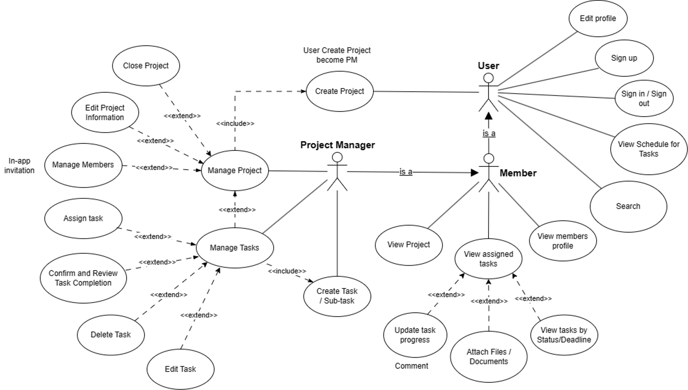

# 📱 ProMa - Project Management Android App

  
  
  **A modern, intuitive project management solution for Android**
  
  
  
  
  

---

## 🌟 Overview

**ProMa** is a feature-rich native Android application designed to streamline project and task management for individuals and teams. Built with modern Android development practices, it provides an intuitive interface for organizing projects, tracking progress, and facilitating team collaboration.

This project demonstrates proficiency in mobile application development, database design, and software architecture principles, serving as both an educational endeavor and a practical productivity tool.

## 🎯 Project Objectives

- **Mobile Development Mastery**: Implement industry-standard Android development practices using Java and MVVM architecture
- **User-Centric Design**: Create an intuitive, accessible interface that enhances productivity
- **Real-World Application**: Build a fully functional app that addresses genuine project management needs
- **Team Collaboration**: Develop features that facilitate effective team communication and task coordination

## ✨ Features & Capabilities

### 🔐 User Management
- Secure user registration and authentication
- Profile management and customization
- Role-based access control

### 📋 Project Organization
- Create and manage multiple projects simultaneously
- Project categorization and prioritization
- Progress tracking and progress management

### ✅ Task Management
- Comprehensive task creation, editing, and deletion
- Task assignment to team members
- Priority levels and deadline management
- Status tracking (To Do, In Progress, Completed)

### 👥 Team Collaboration
- Team member invitation and management
- Task assignment and delegation
- Real-time commenting system
- Activity feeds and updates

### 🔔 Smart Notifications
- Deadline reminders and alerts
- Task assignment notifications
- Project milestone notifications
- Customizable notification preferences

## 🛠️ Technology Stack

| Component | Technology | Purpose |
|-----------|------------|---------|
| **Language** | Java | Core application development |
| **IDE** | Android Studio | Development environment |
| **Architecture** | MVVM | Separation of concerns and maintainability |
| **Database** | Firebase | Cloud-based data storage and synchronization |
| **Version Control** | Git & GitHub | Source code management |
| **UI/UX Design** | Figma | Design prototyping and collaboration |

## 🏗️ Architecture

ProMa follows the **Model-View-ViewModel (MVVM)** architectural pattern, ensuring:

- **Separation of Concerns**: Clear distinction between UI, business logic, and data layers
- **Maintainability**: Easy to modify and extend functionality
- **Testability**: Components can be tested independently
- **Data Binding**: Efficient UI updates and state management

### Architecture Components
- **Model**: Data classes and repository patterns
- **View**: Activities, Fragments, and XML layouts
- **ViewModel**: Business logic and UI state management

## 📊 System Design

### Use Case Diagram

*User interactions and system functionality overview*

### Database Schema

*Relational database structure and entity relationships*

## 🎨 Design Resources

**UI/UX Design**: [View on Figma here!](https://www.figma.com/design/LdYcIKBEv5f3jAm3mUJEia/Proma?node-id=37-463&t=bwzV1nlFcFu14hxb-1)

## 🤝 Team & Contributions

| Team Member | Role | Key Contributions |
|-------------|------|-------------------|
| **Le Quoc Khanh** | Project Lead & Main Developer | System architecture, core development |
| **Le Gia Kiet** | Tester | Testing strategy, bug reporting |
| **Nguyen Thi Thuy** | UI/UX Designer & Task Manager | Interface design, backlog management |
| **Pham Trong Tuan** | Sub Developer  | Sub development

## 📄 License

This project is licensed under the MIT License - see the [LICENSE](LICENSE) file for details.

## 🙏 Acknowledgments

- Course instructors
- Android development community
- Open source libraries and tools used

---

  <strong>Built with ❤️ by the Bululu Team</strong>

